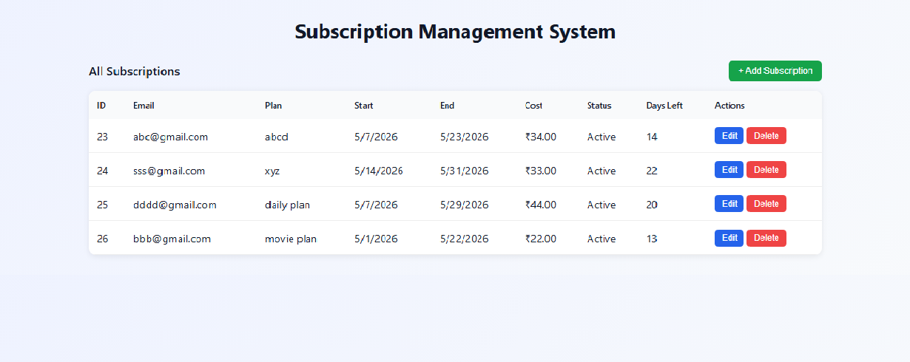

📊 Subscription Management System 

A full-stack web application to manage user subscriptions using React (Frontend) and Node.js + Express + MySQL (Backend). It allows users to perform complete CRUD operations with validation and real-time updates.

 

🚀 Features

➕ Add new subscriptions

✏️ Edit existing subscriptions

❌ Delete subscriptions

📊 View all subscriptions in a table

📅 Date validation (end date cannot be before start date)

🔍 Prevent duplicate subscriptions (same email, plan & dates)

⏳ Automatically calculate remaining days

🔔 Toast notifications for success and errors

 
🛠️ Tech Stack

Frontend: React, Axios, React Toastify

Backend: Node.js, Express.js

Database: MySQL (mysql2)

 
📁 Project Structure

project-root/

 ├── frontend/
 
 └── backend/

  
⚙️ Setup Instructions

1. Clone Repository
   

git clone https://github.com/nikita01710/subscription_management_system.git

cd subscription_management_system

 
🔧 Backend Setup

cd backend

npm install

node server.js

Create a .env file in backend folder:

DB_HOST=localhost

DB_USER=your_username

DB_PASSWORD=your_password

DB_NAME=your_database

 
💻 Frontend Setup

cd frontend

npm install

npm run dev
 
 
🔗 API Endpoints

GET /api/subscriptions → Fetch all subscriptions

POST /api/subscriptions → Add new subscription

PUT /api/subscriptions/:id → Update subscription

DELETE /api/subscriptions/:id → Delete subscription

 
🛢️ Database Schema

CREATE TABLE subscriptions (

  subscription_id INT AUTO_INCREMENT PRIMARY KEY,
  
  user_email VARCHAR(255),
  
  plan_name VARCHAR(100),
  
  start_date DATE,
  
  end_date DATE,
  
  monthly_cost DECIMAL(10,2),
  
  status VARCHAR(50)
  
);

 
📸 Screenshots

### 🧾 Subscription Table

⚠️ Important Notes

Do not upload your .env file (keep credentials private)

Ensure MySQL server is running

Backend should be started before frontend

 
👩‍💻 Author

Nikita Nagal
